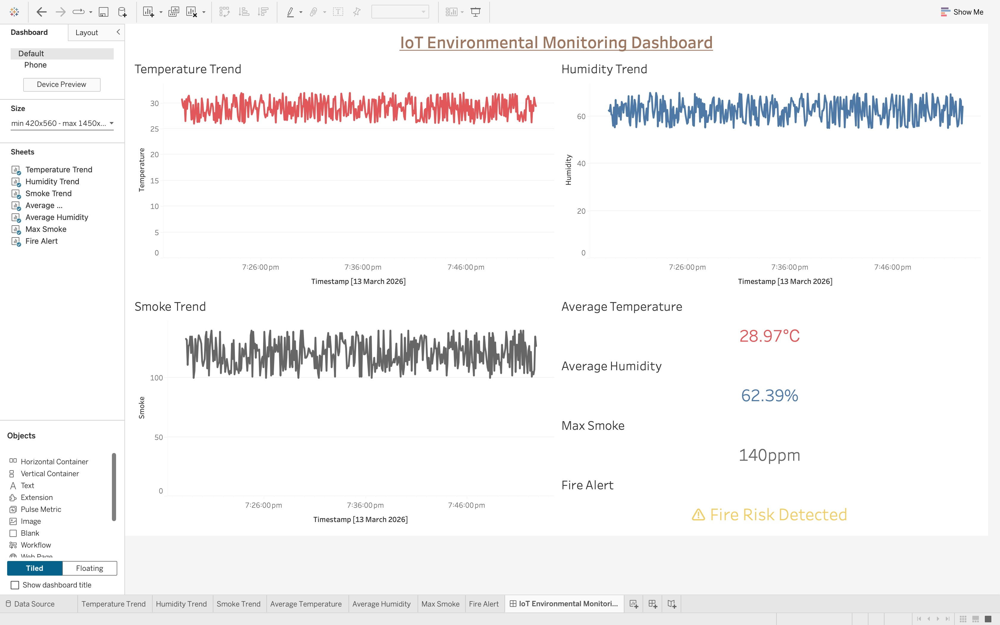

# iot-environmental-monitoring-dashboard
Real-time IoT environmental monitoring dashboard using Python and Tableau
# Real-Time IoT Environmental Monitoring Dashboard

This project simulates an IoT environmental monitoring system that tracks temperature, humidity, and smoke levels using Python and Tableau.

## Features

- Simulated IoT sensor data generation
- Temperature and humidity trend monitoring
- Smoke level monitoring
- Fire risk detection alerts
- KPI metrics for environmental conditions

## Tech Stack

- Python
- Pandas
- Tableau
- Data Visualization

## System Architecture

Python Sensor Simulator → CSV Data → Tableau Dashboard

## Dashboard Preview

